# Q&A をコーディングなしで BOT 化！ Cognitive Services QnA Maker による Q&A Bot 作成

## Cognitive Services の新サービス、QnA Maker
Cognitive Services に QnA Maker と呼ばれる新サービスが追加されました。

- [QnA Maker introduction on Cognitive Services Website](https://azure.microsoft.com/ja-jp/services/cognitive-services/qna-maker/)
- [QnA Maker Website](https://www.qnamaker.ai/)

こちらは、質問＆回答のリスト、または FAQ のような Web サイトから、Q&A を行う BOT をコーディングなしで自動生成できるサービスです。QnA Maker で作成した AI エンジンは、Web API 経由でアクセスして回答を得られる Web サービス として利用できるほか、Azure Bot Service のテンプレートとしても選択できるようになりました。
Q&A のリストを編集・追加も GUI の画面から行うことができます。

## FAQ サイト または リストからの Q&A Bot 作成
### 新規 Q&A Bot サービス の作成
QnA Maker のページ  にアクセスし、上部バーの [Create a knoledge base] をクリックし、ナレッジベースを作成します。

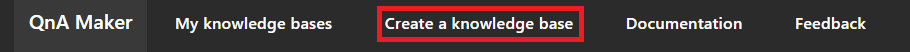

 

STEP1：「Create a QnA service」をクリックするとAzure PortalのQnA Maker作成画面が表示されます。

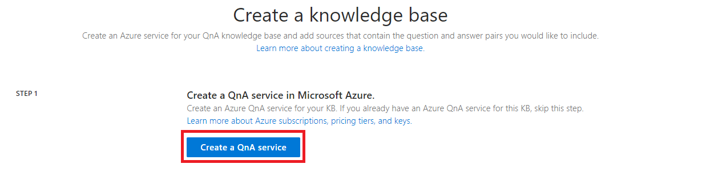

Azure PortalのQnA Maker作成画面で以下の情報を入力します。
- Name：任意の名前を入力します
- サブスクリプション：（自動入力）
- Management pricing tier：F0（無料版）
- Resource group：新規作成でご自身で認識しやすいモノ or 既にお持ちのグループをご利用いただいても構いません
- Search pricing tier：F（無料版）
- Search location：お好みの Azure データセンターの拠点を選択します
- App name：任意の名前（Nameの値が自動で入力されます）
- Website location：お好みの Azure データセンターの拠点を選択します
- App insights：Enable
- App insights location：お好みの Azure データセンターの拠点を選択します

[作成] をクリックすると、サービスが作成されます。
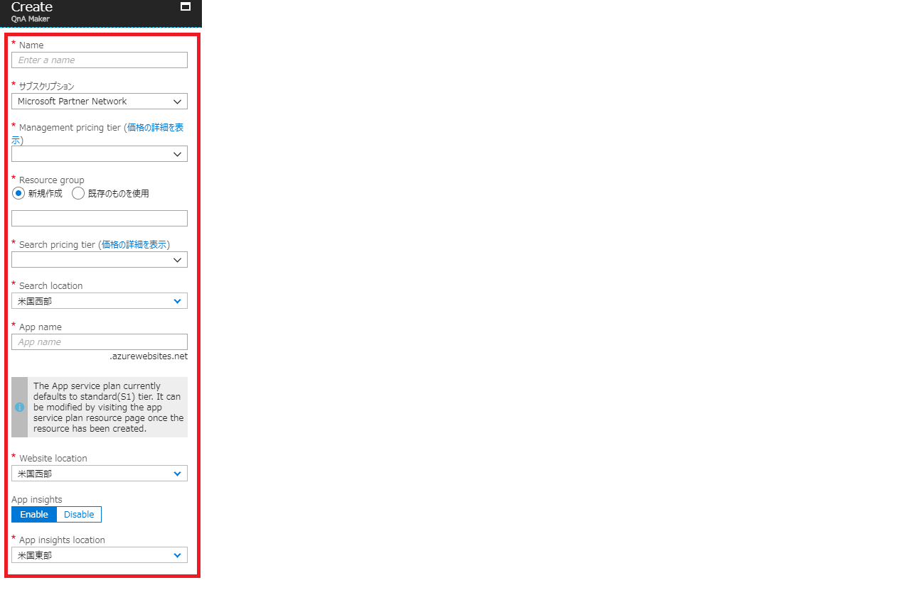

 

STEP2：Azure PortalでQna Makerの作成が完了したら、以下の情報を入力します。
※Qna Makerの作成完了はAzure Portalの画面右上に通知で表示されます。
※QnA Maker のページをリロードすると作成したQna Makerが選択できるようになります。

- Microsoft Azure Directory ID：ご利用のID
- Azure subscription name：ご利用のサブスクリプション
- Azure QnA service：作成したQna Maker

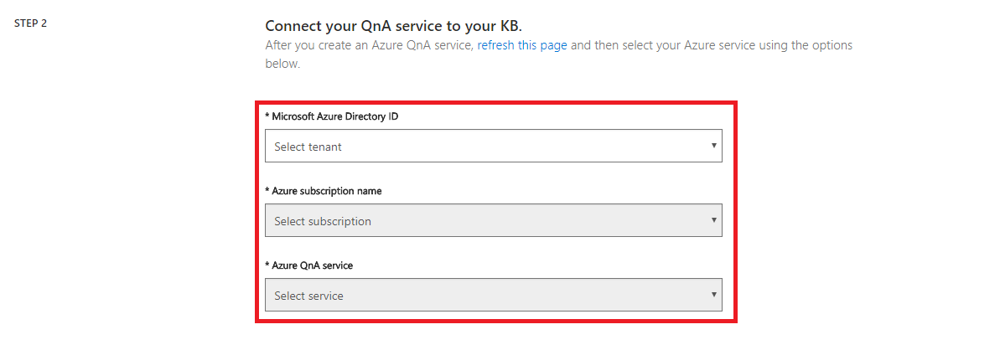

 

STEP3：ナレッジベースに名前をつけます。任意の名前を入力します。

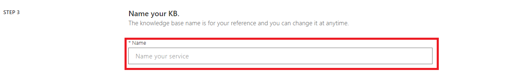

 

STEP4：  
QnA MakerにFAQデータを追加します。FAQ サイト、Q&A を記載したファイルをアップロードすることができます。今回のハンズオンでは「https\://azure.microsoft.com/ja-jp/support/faq/」を入力します。

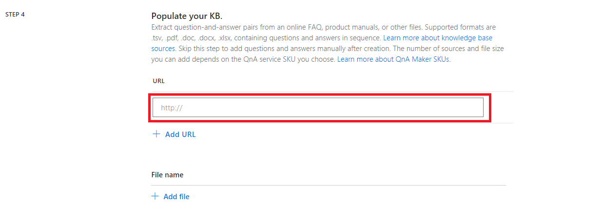

 

STEP5：「Create your KB」をクリックしナレッジベースを作成します。

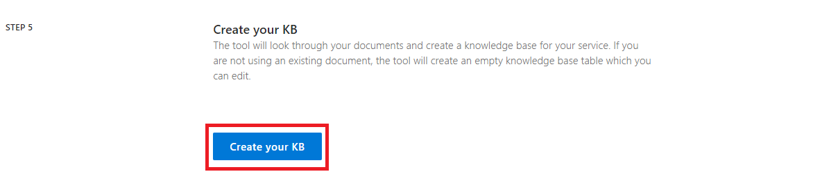

ナレッジベースの作成が完了すると、ナレッジベースの編集ページが開きます。
ナレッジベース編集画面ではQAの編集や、追加、削除を行うことができます。

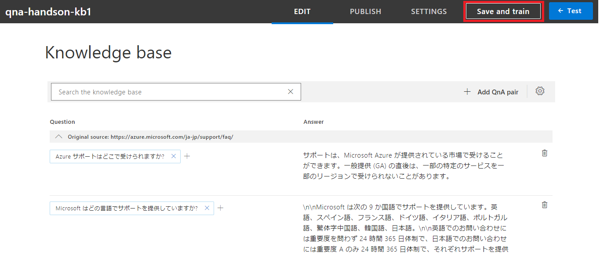

 
QAを変更した場合は、画面右上の[Save and train]をクリックし、編集内容を保存し、QnA Makerモデルのトレーニングを行います。

 
 

### Q&A のテスト
画面右上の[← Test]をクリックすると、QAのテスト用のページが表示され、実際の QnA Makerの動作を確認できます。想定された質問を入力すると、ナレッジベースから適切な答えを Bot が返答します。

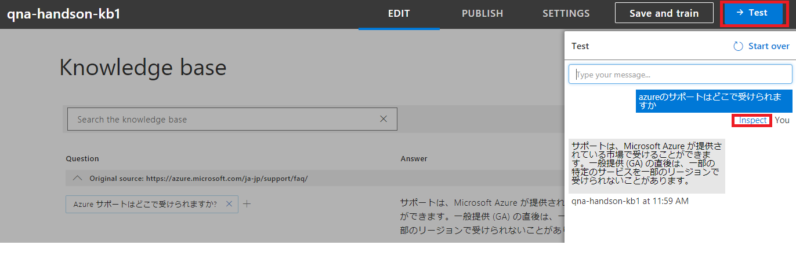

 

[Inspect]をクリックすることでBotの回答の詳細を確認することができます。

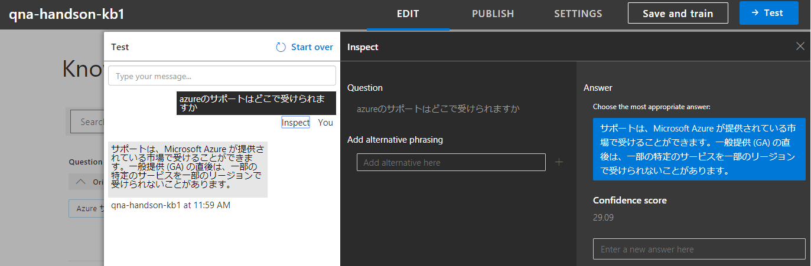

 
 

### QnA Maker の Web 公開
[PUBLISH]をクリックすることでナレッジベースをWebに公開することができます。

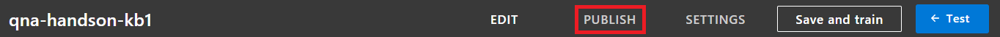

 

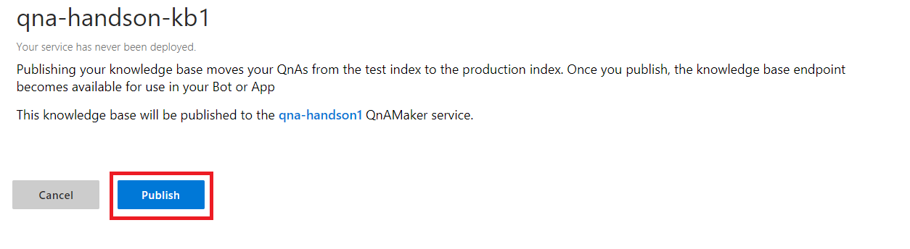

 

QnA Makerサービスが正常に公開されると作成したQnA Makerのエンドポイントが表示されます。

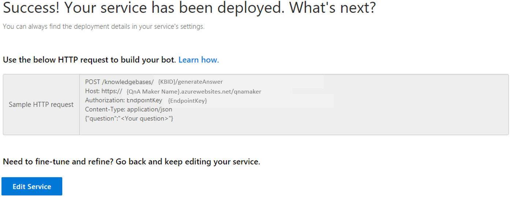

